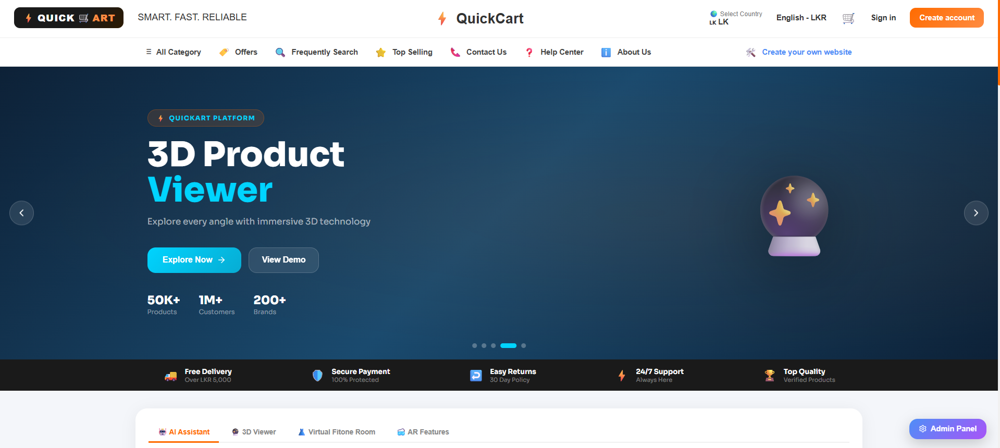

# 🛍️ QuickArt – AI & AR Powered E-Commerce Platform

---

## 📌 1. Introduction

**QuickArt** is a modern e-commerce platform designed to improve the online shopping experience using **Artificial Intelligence (AI)** and **Augmented Reality (AR)**.
It helps both **buyers** and **sellers** interact smarter, faster, and more visually.

---

## 🎯 2. Project Vision

QuickArt aims to:

- Make online shopping more interactive
- Help customers make better buying decisions
- Support sellers with smart tools
- Reduce product return rates using AR visualization

---

## 🤖 3. AI Features

QuickArt includes intelligent AI-powered tools:

### 💬 AI Chatbot

- 24/7 customer support
- Instant answers to product questions
- Order tracking assistance

### 🎙️ Voice Assistant

- Search products using voice
- Navigate the platform hands-free
- Quick command support

---

## 🧩 4. AR Features

QuickArt brings products to life using Augmented Reality.

### 🏠 Virtual Room View

- Place furniture and decor inside your room
- See how products fit before buying

### 📦 3D Product Viewer

- Rotate and zoom products in 3D
- View items from every angle

---

## 👥 5. User Roles

### 🛒 Buyers

- Browse products
- Use AI & AR tools
- Secure checkout
- Track orders

### 🏪 Sellers

- Add and manage products
- Upload 3D product models
- Chat with customers
- Track sales performance

---

## 🌟 6. Unique Advantages

- AI + AR integrated platform
- Smart shopping experience
- Interactive 3D product display
- Voice-enabled browsing
- Easy-to-use interface

---

## 🚀 7. Future Enhancements

- Personalized AI recommendations
- Advanced seller analytics dashboard
- Mobile application integration
- Multi-language support

---

## 📷 8. System Preview

Below is a sample preview layout of QuickArt:

- 🏠 **Home Page** – Featured products & AI assistant
- 🔍 **Smart Search** – Voice & chatbot enabled
- 🛍️ **Product Page** – 3D view + AR room preview
- 📊 **Seller Dashboard** – Product & sales management

